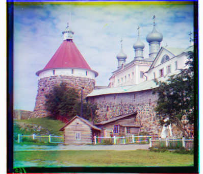

# Images processing

A simple images processing engine created under CMC MSU computer graphics course.
For task requirements see *PRD.pdf*.

The basic part of program combines 3 black and white color channels to get a full color image.
Additional part contains various filters, results can be seen at `results`.

## Build

In project directory run:

```bash
make all
```

Then from `build/bin` run:

```bash
./align <path to input image> <path to resulting image> --align
```

Run `./align --help` to see all available options.

## Results

3 *R, G, B* channels:


Resulting images:


